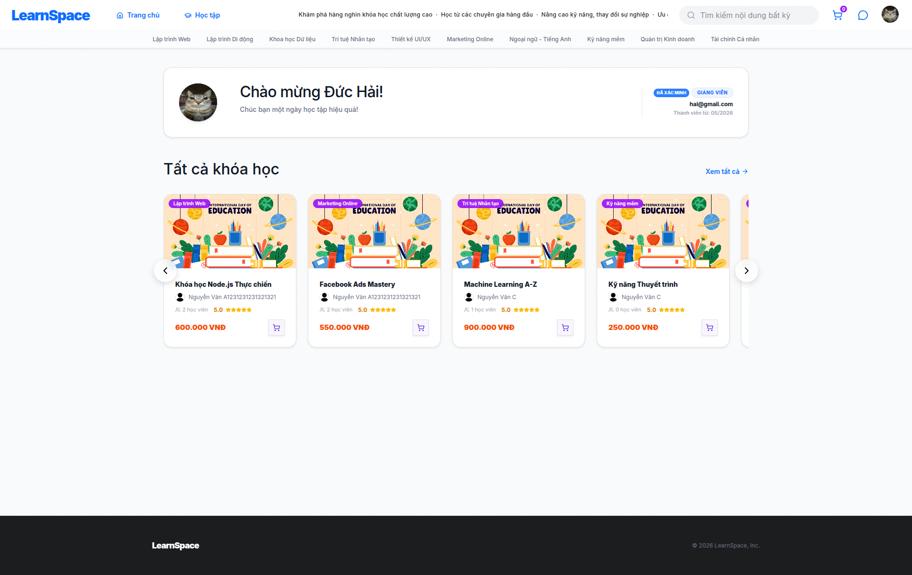
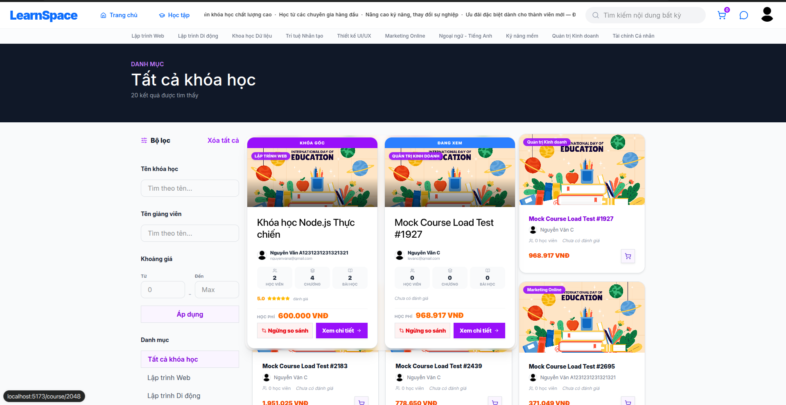
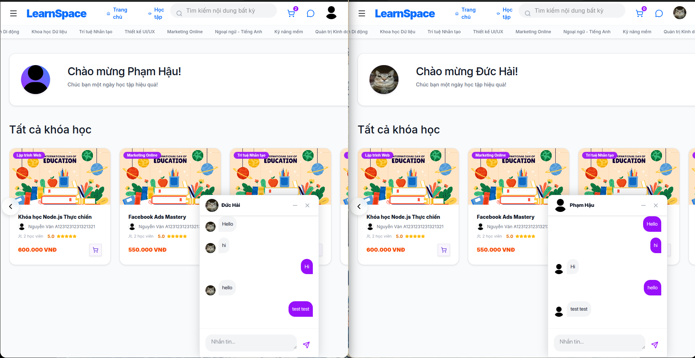

<p align="center">
  <h1 align="center">📚 LearnSpace</h1>
  <p align="center">Nền tảng học trực tuyến E-Learning Fullstack</p>
</p>


# Đề tài

### ĐỀ TÀI 1: KHOÁ HỌC TRỰC TUYẾN

Hệ thống được xây dựng nhằm hỗ trợ việc đăng ký, quản lý và tham gia các khóa học trực
tuyến. Người dùng hệ thống gồm ba vai trò chính: quản trị viên, giảng viên và sinh viên.
Khi đăng ký, tất cả người dùng cần cung cấp đầy đủ thông tin cá nhân và avatar để định
danh. Với vai trò giảng viên, tài khoản cần được quản trị viên duyệt và xác minh trước khi
được phép tạo và quản lý khóa học. Hệ thống phải cho phép người dùng đăng nhập, phân
quyền theo từng vai trò, và bảo đảm tính bảo mật thông tin tài khoản.

Sau khi được phê duyệt, giảng viên có thể tạo mới khóa học bằng cách cung cấp thông tin
như tên khóa học, mô tả chi tiết, hình ảnh minh họa, video giới thiệu, học phí (nếu có) và
thời lượng học. Giảng viên có thể cập nhật, chỉnh sửa, xóa khóa học và quản lý danh sách
sinh viên đã đăng ký. Ngoài ra, hệ thống cần cho phép giảng viên theo dõi tiến độ học tập
của từng sinh viên, qua đó cải thiện chất lượng giảng dạy.

Sinh viên có thể tìm kiếm các khóa học theo nhiều tiêu chí linh hoạt như tên khóa học,
giảng viên phụ trách hoặc mức học phí. Hệ thống hỗ trợ sắp xếp kết quả tìm kiếm theo tên
hoặc chi phí, đồng thời hiển thị kết quả dưới dạng phân trang với tối đa 20 khóa học mỗi
trang.

[Mở rộng] 
* Đối với các khóa học có học phí, sinh viên có thể lựa chọn nhiều phương thức
thanh toán khác nhau như tiền mặt trực tiếp, hoặc thanh toán trực tuyến thông qua PayPal,
Stripe, MoMo, ZaloPay. Mọi khoản giao dịch cần được ghi nhận và lưu trữ trong hệ thống
nhằm phục vụ công tác kiểm tra, quản lý và minh bạch tài chính.

Hệ thống hỗ trợ sinh viên so sánh nhiều khóa học cùng chủ đề dựa trên các tiêu chí như
nội dung giảng dạy, thời lượng học, học phí, giảng viên phụ trách.

Hệ thống cung cấp công cụ thống kê đa dạng. Giảng viên có thể xem số lượng sinh viên
tham gia khóa học, doanh thu theo từng khóa, theo tháng, quý, năm để đánh giá hiệu quả
giảng dạy. Quản trị viên được phép xem báo cáo tổng quan về toàn bộ hệ thống, bao gồm
số lượng khóa học được mở, tần suất đăng ký, doanh thu chung của trường, đồng thời có
thể mở rộng và tùy biến báo cáo để phục vụ quản lý chiến lược.

[Mở rộng] 
* Sinh viên và giảng viên có thể trao đổi trực tiếp thông qua tính năng chat thời
gian thực được tích hợp từ Firebase Realtime Database. 

---

## Tổng quan

**LearnSpace** là nền tảng học trực tuyến cho phép giảng viên tạo và quản lý khóa học, sinh viên tìm kiếm - mua và học khóa học (xem video bài giảng), và quản trị viên giám sát hệ thống qua admin dashboard.

Hệ thống phân quyền theo **3 vai trò chính**:

| Vai trò | Mô tả |
|---------|-------|
| **Sinh viên (Student)** | Tìm kiếm, mua khóa học, xem video bài giảng, theo dõi tiến độ, đánh giá, chat với giảng viên |
| **Giảng viên (Verified Teacher)** | Tạo/quản lý khóa học & bài giảng, xem thống kê doanh thu, chat với sinh viên |
| **Quản trị viên (Admin)** | Dashboard quản lý hệ thống, duyệt giảng viên, quản lý khóa học/người dùng/danh mục |

**Điểm nổi bật:**
- Video streaming bài giảng từ **Cloudflare R2**
- Thanh toán trực tuyến qua **Stripe Checkout**
- Chat thời gian thực với **Firebase Realtime Database**
- Admin dashboard với biểu đồ **Chart.js** (Thymeleaf SSR)
- Dual security: **JWT** (API) + **Session-based** (Admin web)

---

## Tech Stack

| Layer | Công nghệ |
|-------|-----------|
| **Backend** | Java 17, Spring MVC 6 (không dùng Spring Boot do giảng viên yêu cầu), Hibernate ORM 6, Spring Security (JWT + Session), MapStruct |
| **Admin Dashboard** | Thymeleaf, Bootstrap, Chart.js |
| **Frontend** | React 19, Vite 8, TailwindCSS 4, shadcn/ui, React Bootstrap, React Router v6 |
| **State Management** | React Context + useReducer (UserContext, CartContext, UIContext, ChatContext) |
| **Database** | MySQL 9.5 |
| **Cloud & Storage** | Cloudinary (ảnh, intro video), Cloudflare R2 (video bài giảng) |
| **Payment** | Stripe (Checkout Sessions + Webhook) |
| **Realtime** | Firebase Realtime Database + Firebase Auth (custom token) |
| **DevOps** | Docker (multi-stage build), Azure Container Apps, Azure Container Registry |
| **Khác** | Nimbus JOSE JWT (HS256), Apache Tika (file validation), Axios, react-cookies, jwt-decode |

---

## Kiến trúc hệ thống

### Dual Security Architecture

| Layer | Phạm vi | Xác thực | Session |
|-------|---------|----------|---------|
| **API Security** (Order 1) | `/api/**` | JWT Bearer Token (HS256, 24h TTL) | Stateless |
| **Web Security** (Default) | `/**` (Admin) | Form Login + Session | Stateful |

---

## Database Design


---

## ✨ Tính năng chính

### 🎓 Sinh viên (Student)

- **Đăng ký / Đăng nhập** — JWT authentication, upload avatar lên Cloudinary
- **Tìm kiếm khóa học** — Lọc theo tên, giảng viên, danh mục, khoảng giá; sắp xếp; phân trang (20 items/trang)
- **Chi tiết khóa học** — Xem mô tả, intro video, danh sách chapter/lesson, đánh giá
- **Giỏ hàng & Thanh toán** — Thêm nhiều khóa vào giỏ, thanh toán qua Stripe Checkout
- **Học bài** — Xem video bài giảng (streaming từ Cloudflare R2), theo dõi tiến độ (watched seconds, completion status)
- **Đánh giá khóa học** — Rating (1-5 sao) kèm comment
- **Chat thời gian thực** — Nhắn tin trực tiếp với giảng viên qua Firebase, hỗ trợ nhiều cửa sổ chat đồng thời
- **Profile** — Xem/chỉnh sửa thông tin cá nhân

### 👨‍🏫 Giảng viên (Verified Teacher)

- **Đăng ký giảng viên** → Chờ Admin duyệt → Trở thành Verified Teacher
- **Tạo / Sửa / Xóa khóa học** — Upload thumbnail lên Cloudinary, intro video lên Cloudinary
- **Quản lý Chapter & Lesson** — Tổ chức nội dung theo chapter, upload video bài giảng lên Cloudflare R2
- **Teacher Dashboard** — Giao diện quản lý riêng biệt với sidebar navigation
  - **Overview tab**: Thống kê tổng quan (tổng khóa học, sinh viên, doanh thu) + bảng performance
  - **Courses tab**: Danh sách khóa học với phân trang
  - **Manage Course**: Quản lý chi tiết chapter/lesson với 6 modal (Create/Edit Course, Add/Edit Chapter, Add/Edit Lesson)
- **Chat với sinh viên** — Dựa trên danh sách enrollment

### 🔧 Quản trị viên (Admin Dashboard — Thymeleaf SSR)

- **Dashboard tổng quan** — Thẻ thống kê: tổng users, courses, doanh thu
- **Biểu đồ Chart.js**:
  - 📊 Bar chart: Doanh thu theo tháng / quý
  - 📊 Bar chart: Số lượng enrollment theo khóa học
  - 🍩 Doughnut chart: Doanh thu theo danh mục
  - 🏆 Top 10 khóa học đánh giá cao nhất
- **Quản lý giảng viên** — Duyệt / từ chối / xác minh tài khoản giảng viên
- **Quản lý khóa học** — Xem danh sách, xóa khóa học (phân trang)
- **Quản lý danh mục** — CRUD danh mục khóa học
- **Quản lý người dùng** — Xem, cập nhật role/verified, xóa user

---

## 📸 Screenshots

> ⚠️ Thêm screenshots vào thư mục `docs/screenshots/` và uncomment các dòng bên dưới.

<!--
### Trang chủ


### Danh sách khóa học & Tìm kiếm


### Chi tiết khóa học


### Trang học bài (Video Player)


### Giỏ hàng & Thanh toán


### Chat thời gian thực


### Teacher Dashboard


### Admin Dashboard


### Database Design

-->

---

## 🔌 API Endpoints

### Authentication & User

| Method | Endpoint | Auth | Mô tả |
|--------|----------|------|--------|
| `POST` | `/api/users` | Public | Đăng ký tài khoản (multipart form) |
| `POST` | `/api/login` | Public | Đăng nhập → trả về JWT token |
| `GET` | `/api/current-user` | 🔒 Auth | Lấy thông tin user hiện tại |
| `PATCH` | `/api/current-user` | 🔒 Auth | Cập nhật profile |

### Courses

| Method | Endpoint | Auth | Mô tả |
|--------|----------|------|--------|
| `GET` | `/api/courses` | Public | Danh sách khóa học (lọc, sắp xếp, phân trang) |
| `GET` | `/api/courses/{id}` | Public | Chi tiết khóa học |
| `POST` | `/api/courses` | 🔒 Verified Teacher | Tạo khóa học (multipart) |
| `PATCH` | `/api/courses/{id}` | 🔒 Verified Teacher | Cập nhật khóa học |
| `DELETE` | `/api/courses/{id}` | 🔒 Verified Teacher | Xóa khóa học |
| `GET` | `/api/courses/my-courses` | 🔒 Auth | Khóa học đã đăng ký |

### Chapters & Lessons

| Method | Endpoint | Auth | Mô tả |
|--------|----------|------|--------|
| `POST` | `/api/courses/{courseId}/chapters` | 🔒 Verified Teacher | Tạo chapter |
| `PATCH` | `/api/chapters/{id}` | 🔒 Verified Teacher | Cập nhật chapter |
| `DELETE` | `/api/chapters/{id}` | 🔒 Verified Teacher | Xóa chapter |
| `GET` | `/api/lessons/{id}` | 🔒 Auth | Chi tiết lesson |
| `POST` | `/api/chapters/{chapterId}/lessons` | 🔒 Verified Teacher | Tạo lesson (multipart + video) |
| `PATCH` | `/api/lessons/{id}` | 🔒 Verified Teacher | Cập nhật lesson |
| `DELETE` | `/api/lessons/{id}` | 🔒 Verified Teacher | Xóa lesson |

### Enrollment & Payment

| Method | Endpoint | Auth | Mô tả |
|--------|----------|------|--------|
| `POST` | `/api/courses/{courseId}/enrollments` | 🔒 Auth | Đăng ký khóa học |
| `POST` | `/api/payments/checkout` | 🔒 Auth | Tạo Stripe Checkout Session |
| `POST` | `/api/payments/webhook` | Public | Stripe Webhook xác nhận thanh toán |

### Reviews & Progress

| Method | Endpoint | Auth | Mô tả |
|--------|----------|------|--------|
| `GET` | `/api/courses/{courseId}/reviews` | Public | Danh sách đánh giá (phân trang) |
| `POST` | `/api/lessons/{lessonId}/lesson-progress` | 🔒 Auth | Lưu tiến độ học (watched seconds) |

### Chat & Categories

| Method | Endpoint | Auth | Mô tả |
|--------|----------|------|--------|
| `GET` | `/api/categories` | Public | Danh sách danh mục |
| `GET` | `/api/chat/token` | 🔒 Auth | Lấy Firebase custom token |
| `GET` | `/api/chat/contacts` | 🔒 Auth | Danh sách liên hệ chat (dựa trên enrollment) |

---

## 📁 Cấu trúc thư mục

```
LearnSpace/
├── LearnSpaceBackend/                    # Backend - Spring MVC
│   ├── src/main/java/com/learnspace/learnspacebackend/
│   │   ├── configs/                      # Cấu hình Spring (Security, Hibernate, Thymeleaf, CORS, Web)
│   │   ├── controllers/                  # 10 API Controllers + 4 Admin Web Controllers
│   │   ├── dtos/                         # Data Transfer Objects (11 packages)
│   │   ├── filters/                      # JwtFilter - xác thực JWT cho API
│   │   ├── mappers/                      # MapStruct mappers (entity ↔ DTO)
│   │   ├── pojo/                         # 9 JPA Entities + 3 Enums
│   │   ├── repositories/                 # Repository interfaces + implementations (Hibernate Session)
│   │   ├── services/                     # 14 Service interfaces + implementations
│   │   └── utils/                        # JwtUtils (generate/validate token)
│   ├── src/main/resources/
│   │   ├── templates/                    # Thymeleaf templates (admin dashboard)
│   │   ├── static/js/                    # Admin client-side JS
│   │   └── env.properties                # Cấu hình (DB, JWT, Cloudinary, R2, Stripe, Firebase)
│   ├── Dockerfile                        # Multi-stage build (Maven → Tomcat)
│   ├── learnspacedb.sql                  # MySQL database dump
│   └── pom.xml                           # Maven dependencies
│
├── learnspace/                           # Frontend - React
│   ├── src/
│   │   ├── components/                   # UI components
│   │   │   ├── Header/                   # Navigation bar + Search + ChatMenu
│   │   │   ├── Footer/                   # Site footer
│   │   │   ├── Layout/                   # MainLayout (Header + Outlet + Footer)
│   │   │   ├── CourseCard/               # Course card với hover detail
│   │   │   ├── GlobalChat/               # Floating chat windows (Firebase)
│   │   │   ├── GlobalLoading/            # Full-screen loading overlay
│   │   │   ├── GlobalDialog/             # Modal dialog (info/success/error/warning)
│   │   │   ├── ProtectedRoute/           # Auth guard (role-based)
│   │   │   ├── TeacherDashboard/         # Teacher dashboard components
│   │   │   │   ├── OverviewTab/          # Stats + Performance table
│   │   │   │   ├── CoursesTab/           # Course list
│   │   │   │   ├── ManageCourseTab/      # Chapter/Lesson management
│   │   │   │   └── Modals/               # 6 modals (Create/Edit Course, Add/Edit Chapter, Add/Edit Lesson)
│   │   │   └── ui/                       # shadcn/ui components
│   │   ├── screens/                      # Pages
│   │   │   ├── Home/                     # Trang chủ
│   │   │   ├── SearchResult/             # Tìm kiếm & lọc khóa học
│   │   │   ├── CourseDetail/             # Chi tiết khóa học
│   │   │   ├── Learning/                 # Trang học bài
│   │   │   ├── Cart/                     # Giỏ hàng
│   │   │   ├── Payment/                  # Thanh toán thành công
│   │   │   ├── Teacher/                  # Teacher Dashboard
│   │   │   ├── Profile/                  # Hồ sơ cá nhân
│   │   │   ├── User/                     # Login & Register
│   │   │   └── Error/                    # Error 403 & Required Login
│   │   ├── configs/                      # Axios instances, Context, Firebase config
│   │   ├── reducers/                     # UserReducer, CartReducer, UIReducer, ChatReducer
│   │   ├── hooks/                        # useTeacherDashBoard (CRUD hook)
│   │   ├── services/                     # API service layer
│   │   └── App.jsx                       # Routing & Context providers
│   ├── package.json
│   └── vite.config.js
│
├── docs/screenshots/                     # Screenshots (thêm ảnh tại đây)
└── README.md
```

---

## 🚀 Cài đặt & Chạy project

### Yêu cầu

- Java 17+
- Maven 3.9+
- Node.js 18+ (hoặc Bun)
- MySQL 8.x / 9.x
- Tomcat 10.1 (hoặc Docker)

### 1. Database

```bash
# Tạo database
mysql -u root -p -e "CREATE DATABASE learnspacedb CHARACTER SET utf8mb4 COLLATE utf8mb4_unicode_ci;"

# Import schema & sample data
mysql -u root -p learnspacedb < LearnSpaceBackend/learnspacedb.sql
```

### 2. Backend

```bash
cd LearnSpaceBackend

# Cấu hình file src/main/resources/env.properties:
# - DB_URL, DB_USERNAME, DB_PASSWORD
# - jwt.secret
# - cloudinary.cloud_name, cloudinary.api_key, cloudinary.api_secret
# - r2.account_id, r2.access_key, r2.secret_key, r2.bucket_name, r2.public_url
# - stripe.secret_key, stripe.public_key, stripe.webhook_secret, stripe.success_url, stripe.cancel_url
# - Firebase service account JSON file trong classpath

# Build WAR
mvn clean package -DskipTests

# Deploy lên Tomcat 10.1
cp target/LearnSpaceBackend-1.0-SNAPSHOT.war $TOMCAT_HOME/webapps/ROOT.war

# Hoặc chạy trực tiếp với Docker (xem bên dưới)
```

### 3. Frontend

```bash
cd learnspace

# Cấu hình file .env:
# VITE_FIREBASE_API_KEY=...
# VITE_FIREBASE_AUTH_DOMAIN=...
# VITE_FIREBASE_DATABASE_URL=...
# VITE_FIREBASE_PROJECT_ID=...
# (và các biến Firebase khác)

# Cài dependencies
bun install
# hoặc: npm install

# Chạy dev server
bun run dev
# hoặc: npm run dev

# Frontend chạy tại http://localhost:5173
```

### 4. Docker (Backend)

```bash
cd LearnSpaceBackend

# Build image
docker build -t learnspace-backend .

# Chạy container
docker run -p 8080:8080 \
  -e DB_URL="jdbc:mysql://host.docker.internal:3306/learnspacedb" \
  -e DB_USERNAME="root" \
  -e DB_PASSWORD="your_password" \
  learnspace-backend
```

---

## ☁️ Deployment

| Service | Mục đích |
|---------|----------|
| **Azure Container Apps** | Host backend container (Southeast Asia region) |
| **Azure Container Registry** | Lưu trữ Docker image |
| **Azure Database for MySQL** | Managed MySQL database |

```bash
# Build & push image
docker build -t learnspaceregistry.azurecr.io/learnspace-app:latest .
docker push learnspaceregistry.azurecr.io/learnspace-app:latest
```

---

## 📄 License

Project này được phát triển cho mục đích học tập.
