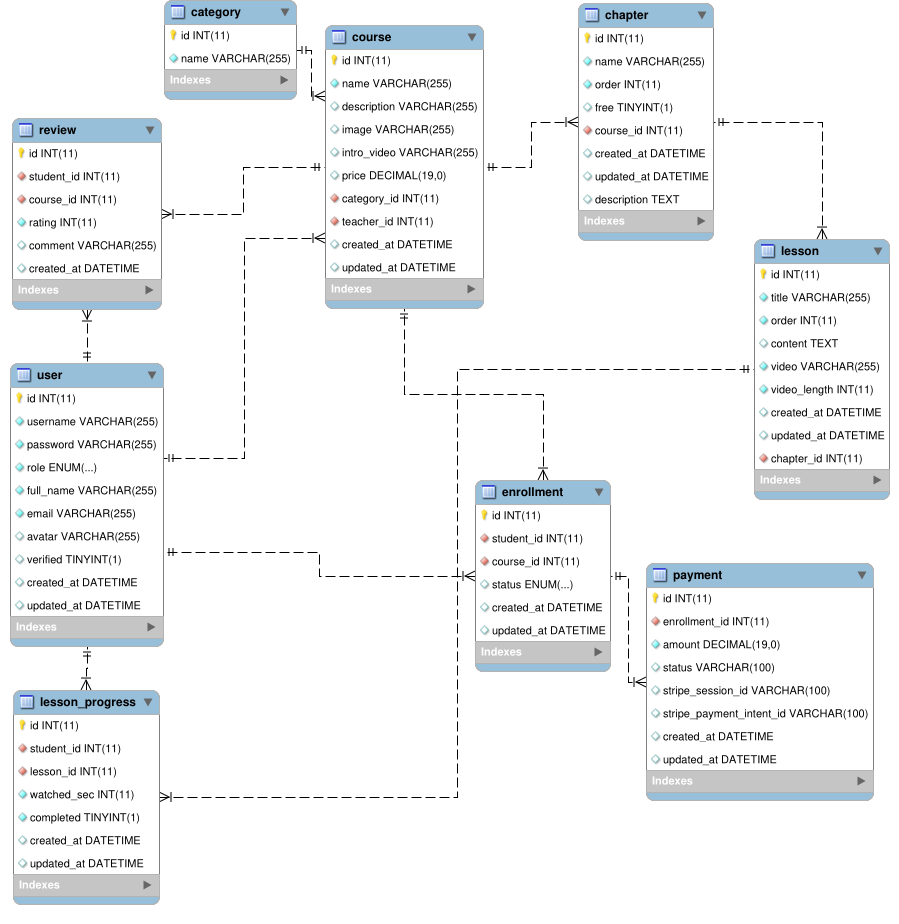
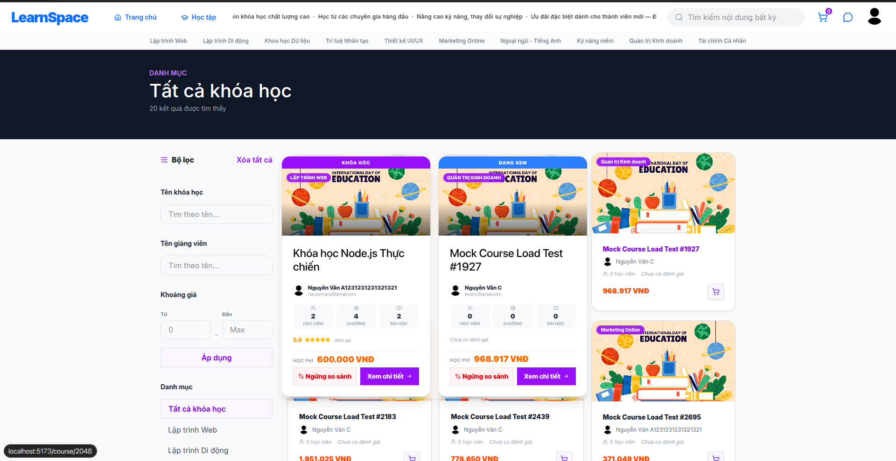
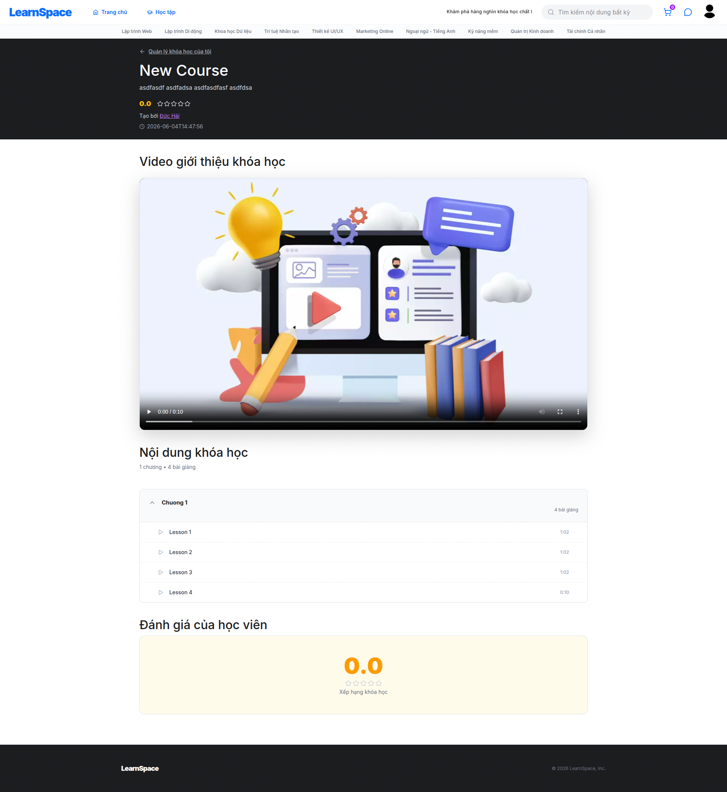
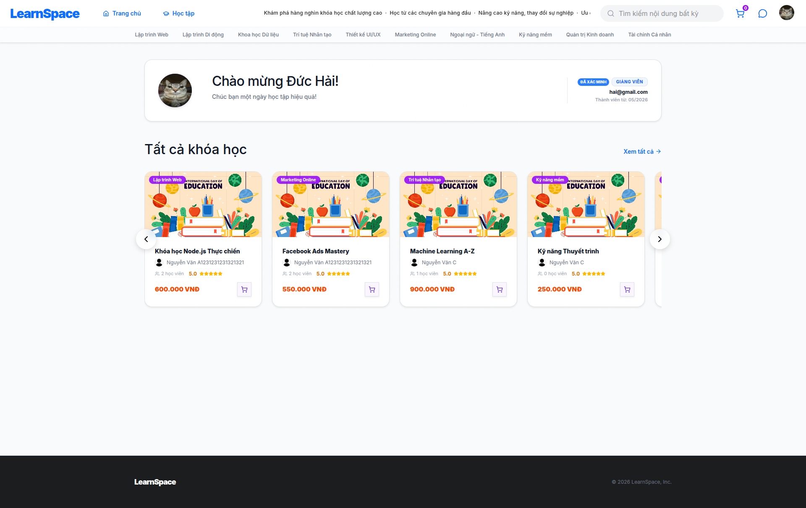
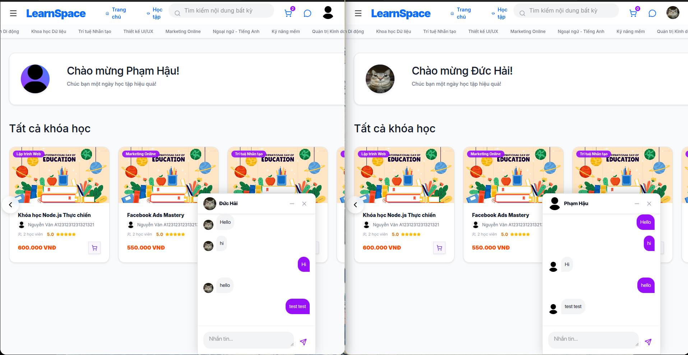
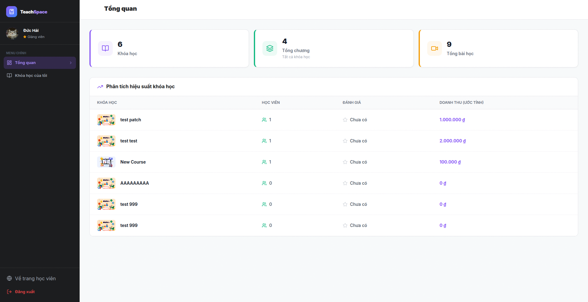
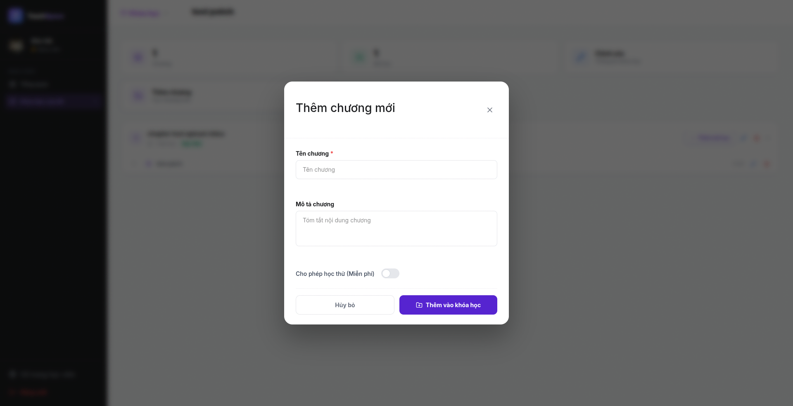
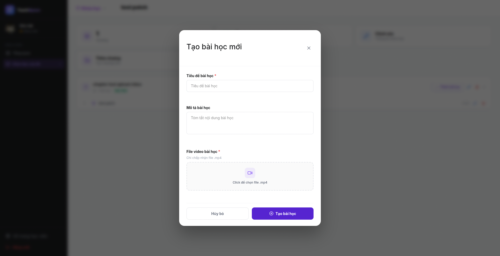
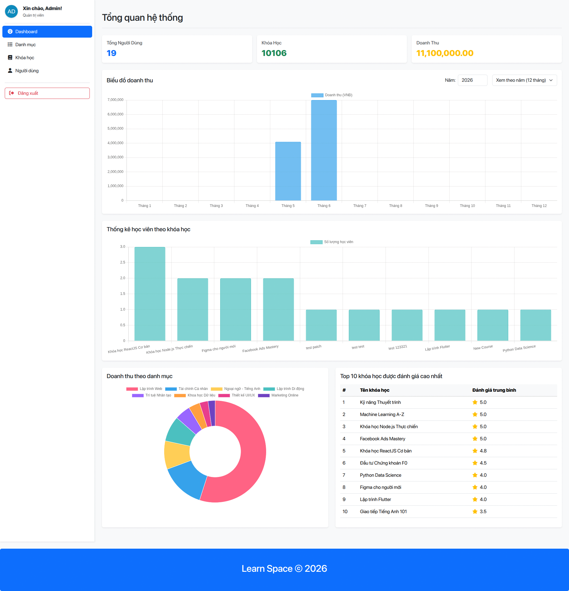

  <h1 align="center">LearnSpace</h1>

# Đề tài

### ĐỀ TÀI 1: KHOÁ HỌC TRỰC TUYẾN

Hệ thống được xây dựng nhằm hỗ trợ việc đăng ký, quản lý và tham gia các khóa học trực
tuyến. Người dùng hệ thống gồm ba vai trò chính: quản trị viên, giảng viên và sinh viên.
Khi đăng ký, tất cả người dùng cần cung cấp đầy đủ thông tin cá nhân và avatar để định
danh. Với vai trò giảng viên, tài khoản cần được quản trị viên duyệt và xác minh trước khi
được phép tạo và quản lý khóa học. Hệ thống phải cho phép người dùng đăng nhập, phân
quyền theo từng vai trò, và bảo đảm tính bảo mật thông tin tài khoản.

Sau khi được phê duyệt, giảng viên có thể tạo mới khóa học bằng cách cung cấp thông tin
như tên khóa học, mô tả chi tiết, hình ảnh minh họa, video giới thiệu, học phí (nếu có) và
thời lượng học. Giảng viên có thể cập nhật, chỉnh sửa, xóa khóa học và quản lý danh sách
sinh viên đã đăng ký. Ngoài ra, hệ thống cần cho phép giảng viên theo dõi tiến độ học tập
của từng sinh viên, qua đó cải thiện chất lượng giảng dạy.

Sinh viên có thể tìm kiếm các khóa học theo nhiều tiêu chí linh hoạt như tên khóa học,
giảng viên phụ trách hoặc mức học phí. Hệ thống hỗ trợ sắp xếp kết quả tìm kiếm theo tên
hoặc chi phí, đồng thời hiển thị kết quả dưới dạng phân trang với tối đa 20 khóa học mỗi
trang.

[Mở rộng] 
* Đối với các khóa học có học phí, sinh viên có thể lựa chọn nhiều phương thức
thanh toán khác nhau như tiền mặt trực tiếp, hoặc thanh toán trực tuyến thông qua PayPal,
Stripe, MoMo, ZaloPay. Mọi khoản giao dịch cần được ghi nhận và lưu trữ trong hệ thống
nhằm phục vụ công tác kiểm tra, quản lý và minh bạch tài chính.

Hệ thống hỗ trợ sinh viên so sánh nhiều khóa học cùng chủ đề dựa trên các tiêu chí như
nội dung giảng dạy, thời lượng học, học phí, giảng viên phụ trách.

Hệ thống cung cấp công cụ thống kê đa dạng. Giảng viên có thể xem số lượng sinh viên
tham gia khóa học, doanh thu theo từng khóa, theo tháng, quý, năm để đánh giá hiệu quả
giảng dạy. Quản trị viên được phép xem báo cáo tổng quan về toàn bộ hệ thống, bao gồm
số lượng khóa học được mở, tần suất đăng ký, doanh thu chung của trường, đồng thời có
thể mở rộng và tùy biến báo cáo để phục vụ quản lý chiến lược.

[Mở rộng] 
* Sinh viên và giảng viên có thể trao đổi trực tiếp thông qua tính năng chat thời
gian thực được tích hợp từ Firebase Realtime Database. 

---

## Tổng quan

**LearnSpace** là nền tảng học trực tuyến cho phép giảng viên tạo và quản lý khóa học, sinh viên tìm kiếm - mua và học khóa học (xem video bài giảng), và quản trị viên giám sát hệ thống qua admin dashboard.

Hệ thống phân quyền theo **3 vai trò chính**:

| Vai trò | Mô tả |
|---------|-------|
| **Sinh viên (Student)** | Tìm kiếm, mua khóa học, xem video bài giảng, theo dõi tiến độ, đánh giá, chat với giảng viên |
| **Giảng viên (Verified Teacher)** | Tạo/quản lý khóa học & bài giảng, xem thống kê doanh thu, chat với sinh viên |
| **Quản trị viên (Admin)** | Dashboard quản lý hệ thống, duyệt giảng viên, quản lý khóa học/người dùng/danh mục |

---

## Database Design

---

## Tính năng chính

### Student

- **Đăng ký / Đăng nhập** - JWT authentication, upload avatar lên Cloudinary
- **Tìm kiếm khóa học** - Lọc theo tên, giảng viên, danh mục, khoảng giá; sắp xếp; phân trang
- **Chi tiết khóa học** - Xem mô tả, intro video, danh sách chapter/lesson, đánh giá
- **Giỏ hàng & Thanh toán** - Thêm nhiều khóa vào giỏ, thanh toán qua Stripe Checkout
- **Học bài** - Xem video bài giảng (streaming từ Cloudflare R2), theo dõi tiến độ (watched seconds, completion status)
- **Đánh giá khóa học** - Rating (1-5 sao) kèm comment
- **Chat thời gian thực** - Nhắn tin trực tiếp với giảng viên qua Firebase, hỗ trợ nhiều cửa sổ chat đồng thời
- **Profile** - Xem/chỉnh sửa thông tin cá nhân

### Verified Teacher

- **Đăng ký giảng viên** -> Chờ Admin duyệt -> Trở thành Verified Teacher
- **Tạo / Sửa / Xóa khóa học** - Upload thumbnail lên Cloudinary, intro video lên Cloudinary
- **Quản lý Chapter & Lesson** - Tổ chức nội dung theo chapter, upload video bài giảng lên Cloudflare R2
- **Teacher Dashboard** - Giao diện quản lý riêng biệt với sidebar navigation
  - **Overview tab**: Xem thống kê tổng quan (tổng khóa học, sinh viên, doanh thu) + bảng performance
  - **Courses tab**: Danh sách khóa học với phân trang
  - **Manage Course**: Quản lý chi tiết chapter/lesson
- **Chat với sinh viên** - Dựa trên danh sách enrollment

### Admin

- **Dashboard tổng quan** - Thẻ thống kê: tổng users, courses, doanh thu
- **Biểu đồ Chart.js**:
  - Doanh thu theo tháng / quý
  - Số lượng enrollment theo khóa học
  - Doanh thu theo danh mục
  - Top 10 khóa học đánh giá cao nhất
- **Quản lý giảng viên** - Duyệt / từ chối / xác minh tài khoản giảng viên
- **Quản lý khóa học** - Xem danh sách, xóa khóa học (phân trang)
- **Quản lý danh mục** - CRUD danh mục khóa học
- **Quản lý người dùng** - Xem, cập nhật thông tin role/verified, xóa user

---

## Screenshots

### Trang chủ

### Danh sách khóa học & Tìm kiếm

### Chi tiết khóa học

### Trang học bài (Video Player)

### Giỏ hàng & Thanh toán

### Chat thời gian thực

### Teacher Dashboard

### Giảng viên thêm Chapter/Lesson

### Admin Dashboard

